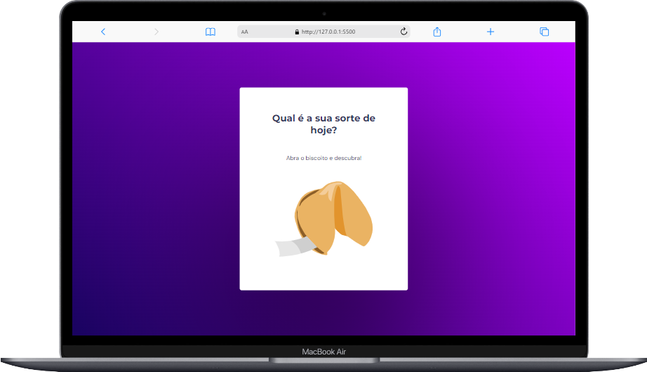
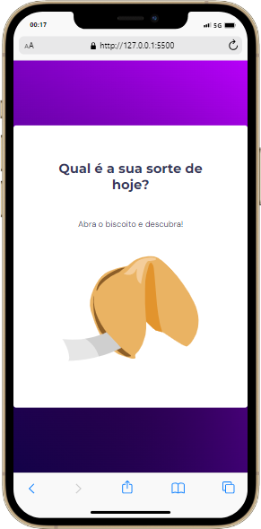

<h1 align="center">Desafio Biscoito da Sorte
</h1>

## 🚀 Tecnologias

Esse projeto foi desenvolvido com as seguintes tecnologias:

- HTML
- CSS
- JavaScript

## 💻 Projeto

desafio do biscoito da sorte, desafio do curso explorer Rocketseat
o usuario deve clickar no biscoito da sorte e aparecera uma mensagem animada ou não!

## sobre

Esse projeto foi feito apartir do aprendizado do curso Explorer da rocketseat

## imagens do projeto

## imagens do projeto em display menores

    

